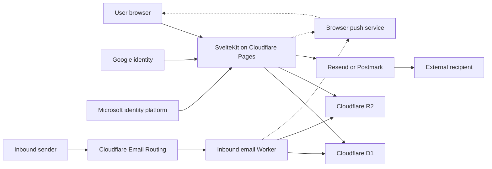

# Architecture and trust boundaries

cmail separates authenticated web and administration traffic from inbound mail
processing. Both runtimes use the same Cloudflare D1 database and R2 bucket.

## Components

| Component | Responsibility | Does not do |
|---|---|---|
| Web application | OAuth callbacks, sessions, mailbox UI, administration, internal delivery, and outbound-provider submission | Receive Email Routing events |
| Inbound email Worker | Validate routed recipients, parse inbound messages, store content, and run bounded retention work | Authenticate users or submit external outbound mail |
| D1 | Users, immutable provider bindings, hashed enrolment tokens, mailboxes, assignments, message metadata, atomic mailbox reservations, sessions, policy, audit, trace, retention, and organisation records | Store deployment secrets or raw enrolment tokens |
| R2 | Message bodies and attachment objects | Decide mailbox authorization |
| Google or Microsoft | Authenticate identities selected by the operator | Automatically authorize or provision ordinary cmail users |
| Resend or Postmark | Deliver external outbound messages | Store cmail mailbox permissions |
| Browser push service | Best-effort delivery of generic, user-enabled new-mail notices | Receive sender, subject, mailbox, body, or attachment data from cmail |

## Primary flows

### Authentication

The sign-in page exposes only providers whose complete configuration is ready.
The server uses the OpenID Connect authorization-code flow with PKCE and state
validation, requests `openid email profile`, and calls UserInfo with the access
token. Google uses `https://openidconnect.googleapis.com/v1/userinfo` and
Microsoft uses `https://graph.microsoft.com/oidc/userinfo`. The durable identity
is the provider plus immutable UserInfo `sub`; returning login never selects a
user by email, UPN, or an ID-token claim. Application sessions are
server-validated and remain separate from provider tokens.

For first sign-in, a manager sends a provider-specific first-party enrolment
link. D1 stores only the token hash. The 72-hour token is single-use; its route
captures a validated enrolment into a 15-minute protected first-party cookie
before OIDC. It is `HttpOnly`, `SameSite=Lax`, and `Secure` on production
HTTPS. Binding also requires a matching access-token-backed UserInfo email:
Google requires `email_verified=true`; Microsoft requires its non-empty OIDC
UserInfo `email` claim alongside the invitation because that endpoint omits
`email_verified`. Resending rotates the token and revokes the old link. Accounts
created without delivery remain pending and unbound.

The first manager is the only invitation exception. A strong bootstrap token
and exact bootstrap email must both be present temporarily. A same-origin POST
to `/bootstrap` exchanges the token for a signed 10-minute `HttpOnly` proof;
neither credential appears in a URL or log, and the proof remains in the
protected first-party cookie during the callback. Both deployment secrets are
removed once the first manager's provider subject is bound.

### Inbound mail

Cloudflare Email Routing invokes the email Worker. The Worker validates message
size and envelope addresses, accepts only active recipients represented in D1,
and suppresses established duplicate deliveries. It then uses a single D1
reservation insert to enforce per-mailbox rolling message/byte limits,
mailbox-scoped HMAC sender limits, and an approximate retained-storage quota.
The insert and its SQLite guard triggers are one write transaction, so
concurrent deliveries cannot all pass a stale counter read. A unique delivery
key also allows only one concurrent copy of the same message to continue.

Only after that reservation succeeds does the Worker read and parse the raw
message, enforce decoded byte/element/depth ceilings, sanitize its HTML,
validate bounded attachments, and write opaque-keyed R2 objects plus
D1 message metadata. A successful message insert atomically settles its pending
storage reservation; rejected or failed processing releases that pending charge
while retaining the rolling-hour abuse charge. Unknown/inactive recipients and
guarded deliveries are rejected before R2 persistence.

### Outbound mail

The web application checks the authenticated user's mailbox assignment and
send permission before accepting a compose request. Internal recipients are
written directly to cmail storage. External recipients use the configured
Resend or Postmark account. Per-send ceilings and per-user rate/work limits
bound recipient, payload, and R2 amplification. Before either a provider call
or R2 write, one D1 batch reserves the exact persisted bytes for the sender's
Sent copy and every internal mailbox copy. A denial releases the whole group;
successful message inserts atomically settle each pending charge. The compose
token remains the external provider idempotency key.

Draft autosaves have a separate per-user/mailbox rate. New drafts and mailbox
moves reserve an atomic owned-draft slot, while growth reserves only its stored
HTML byte delta. Versioned R2 replacement preserves the prior draft body until
the D1 update succeeds; the update trigger then settles its reservation.

### Public organisation directory

Administration records are manager-only. `GET /api/organization` is the single
intentional public projection and returns an empty array unless its master
switch is enabled. It selects only explicitly public, active positions and
returns the occupant display name, work email, and position title. It does not
return user IDs, login addresses, hierarchy, or other organisation metadata.

### Optional browser notifications

Web Push remains disabled unless the Pages app and inbound Worker share a
complete VAPID public/private key pair and subject. A signed-in user must opt in
through an explicit gesture. Subscriptions are user-owned and notification
payloads contain only generic new-mail copy plus an authenticated in-app route;
message and mailbox metadata are excluded. Push endpoints are restricted to a
built-in service-host allowlist plus operator-reviewed additions.

## Trust boundaries

- Treat browser input, routed email, provider responses, message HTML,
  attachments, and configuration values as untrusted.
- Authorization belongs on server routes and actions; hiding a UI control is
  not an authorization decision.
- D1 and R2 bindings grant data-plane access. Limit who can change Pages,
  Worker, provider, DNS, and Cloudflare account configuration.
- OAuth client secrets, session keys, outbound API keys, bootstrap token and
  email, tenant IDs, and resource IDs are deployment-owned values. Keep
  sensitive values in secret stores and local ignored files. Treat raw
  enrolment links and bootstrap proofs as short-lived credentials.
- The inbound sender-HMAC key is a Worker-only secret. It prevents raw sender
  addresses from entering the short-lived abuse ledger and must not be reused
  as a session, OAuth, provider, or VAPID key.
- Email authentication and delivery reputation also depend on operator-managed
  DNS and provider configuration outside this repository.
- Configuring Web Push adds browser push services as outbound destinations;
  protect the VAPID private key and review every endpoint-host extension.

## Storage-accounting boundary

The shared retained-storage control intentionally uses D1
`messages.size_bytes` plus active reservations instead of listing R2 on every
inbound delivery, send, or draft save. It is atomic, inexpensive, and includes trash until purge, but it is
an estimate of retained message data rather than Cloudflare billing truth.
Legacy rows with inaccurate sizes and encoding differences can skew it. D1 and
R2 also have no shared transaction: handled errors clean up opaque objects, but
an abrupt termination between an R2 write and its D1 row can leave an object
that requires periodic reconciliation. Operators should monitor D1/R2 growth,
run retention deliberately, and maintain a recovery/reconciliation procedure.

## Deployment assumptions

cmail currently targets Cloudflare Pages, Workers, D1, R2, and Email Routing.
It is not a general SMTP or IMAP server and is not a drop-in implementation of
Exchange protocols. The repository does not create identity-provider
registrations, mail-provider accounts, DNS records, backups, alerts, or legal
policies for an operator.

Review the [configuration reference](configuration.md),
[deployment guide](deployment.md), and [security checklist](security-checklist.md)
before altering these boundaries.

[← Documentation home](README.md)
