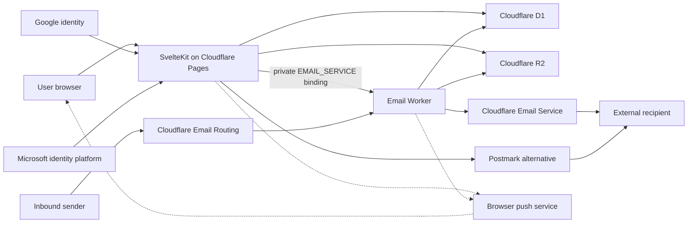

# Architecture and trust boundaries

cmail separates authenticated web/admin traffic from inbound mail processing. Both runtimes share the same Cloudflare D1 database and R2 bucket.

## Components

| Component | Responsibility | Does not do |
|---|---|---|
| Web application | OAuth callbacks, sessions, mailbox UI, administration, internal delivery, and outbound-provider submission | Receive Email Routing events |
| Email Worker | Validate routed recipients, parse and store inbound mail, run bounded retention, and submit Cloudflare outbound mail over a private binding | Authenticate users or decide mailbox send permission |
| D1 | Users, immutable provider bindings, hashed enrolment tokens, mailboxes, assignments, message metadata, atomic reservations, sessions, policy, audit, trace, retention, and organisation records | Store deployment secrets or raw enrolment tokens |
| R2 | Message bodies and attachment objects | Decide mailbox authorization |
| Google or Microsoft | Authenticate identities selected by the operator | Auto-authorize or provision ordinary cmail users |
| Cloudflare Email Service or Postmark | Deliver external outbound messages | Store cmail mailbox permissions |
| Browser push service | Best-effort delivery of generic, user-enabled new-mail notices | Receive sender, subject, mailbox, body, or attachment data from cmail |

## Primary flows

### Authentication

The sign-in page shows only providers with complete configuration. The server uses OpenID Connect (OIDC, a standard sign-in protocol) authorization-code flow with PKCE and state validation: it requests `openid email profile` and calls UserInfo with the access token — Google at `https://openidconnect.googleapis.com/v1/userinfo`, Microsoft at `https://graph.microsoft.com/oidc/userinfo`. Durable identity is provider plus immutable UserInfo `sub`; returning sign-in never uses email, UPN (Microsoft's internal username-like ID), or an ID-token claim. Sessions are server-validated, separate from provider tokens.

For first sign-in, a manager sends a provider-specific enrolment link; D1 stores only its hash. The 72-hour, single-use token gets captured into a 15-minute `HttpOnly`, `SameSite=Lax` cookie (`Secure` in production) before OIDC starts. Binding also needs a matching UserInfo email — Google's `email_verified=true`, or Microsoft's non-empty `email` claim, since Microsoft UserInfo omits `email_verified`. Resending rotates the token and revokes the old link; invitation-less accounts stay pending and unbound.

The first manager is the only exception: a strong bootstrap token and exact email must both be set temporarily. A same-origin POST to `/bootstrap` exchanges the token for a signed 10-minute `HttpOnly` proof — neither credential appears in a URL or log. Delete both secrets once the first manager's provider subject is bound.

A third method, an invitation-scoped email one-time code, exists for invitees whose mail is hosted by neither Google nor Microsoft. Codes are 8 digits, HMAC-hashed at rest with `SESSION_SECRET`, expire after 5 minutes, and die after 5 attempts; request and verify responses stay identical regardless of the failure reason, so only the audit log reveals what actually happened. Its session lifetime is capped independently of the general session setting, and the Manager role always requires a Google or Microsoft identity — an email-code-only account can never receive a Manager session.

Every successful sign-in, across all three methods, is checked once more before a session is created: an organisation can restrict sign-in to an approved list of countries, off by default. The check runs after identity is confirmed but before a session exists, so a refusal doesn't need to hide anything about who the person is — it creates a pending request, notifies managers (throttled to at most once per person/country pair every six hours), and the person can retry once a manager approves it. The first manager's bootstrap sign-in is exempt, so a deployment can never lock itself out of creating its own first manager.

### Inbound mail

Cloudflare Email Routing invokes the email Worker, which checks message size and envelope addresses, accepts only active D1 recipients, and drops duplicates. One D1 insert then reserves per-mailbox rolling message/byte limits, mailbox-scoped HMAC (cryptographic signing) sender limits, and an approximate storage quota, all in one write transaction — so concurrent deliveries can't pass a stale counter read, and a unique delivery key lets only one concurrent copy continue.

Only then does the Worker parse the raw message, enforce decoded byte/element/depth ceilings, sanitize its HTML, validate attachments, and write R2 objects plus D1 metadata. A successful insert settles the pending storage reservation; a rejection releases it but keeps the rolling-hour abuse charge. Unknown or inactive recipients are rejected before anything reaches R2.

### Outbound mail

The web application checks the signed-in user's mailbox assignment and send permission before accepting a compose request. Internal-only recipients go straight to cmail storage; external recipients use the configured Cloudflare Email Service or Postmark account. For Cloudflare, Pages sends a bounded request over its private `EMAIL_SERVICE` binding to the email Worker, which owns the outbound call and keeps `workers_dev=false`, `preview_urls=false`, explicit empty routes, and a private-hostname guard on its fetch handler. Its `send_email` result is an opaque tracking ID, not the wire RFC `Message-ID` — cmail stores the two separately.

Mixed local/external mail, when Cloudflare REST credentials are also configured, uses `send_raw` instead: the MIME copy keeps the full To/Cc lists, the SMTP envelope carries only external recipients, and local copies stay synchronous. Otherwise native Cloudflare or Postmark gets one all-recipient submission — every recipient sees identical headers, and local copies return asynchronously through Email Routing, so this path depends on inbound routing and quota working. cmail validates the REST API's RFC-style `result.message_id` when present; opaque tracking IDs never substitute for it.

Per-send ceilings and per-user rate/work limits bound recipient count, payload size, and R2 amplification. D1 reserves bytes for every copy before any provider call or R2 write; local copies returned via the inbound path use its own reservation on arrival, though the compose workload cap still budgets their expected storage. A denial releases the whole reservation group.

Before dispatch, cmail stages immutable HTML, plain text, and attachment bytes under a private R2 outbound-journal prefix, commits a D1 manifest (fixed Sent/local message and attachment IDs, durable quota reservations), and verifies D1 SHA-256 digests against the staged bytes before both dispatch and local materialisation. The journal then moves atomically from `pending` to `dispatching` before cmail calls the provider.

Provider success moves it to `accepted`; targets materialise idempotently, the journal becomes `materialized`, and the source draft disappears — so an accepted send can recover its Sent/internal copies without calling the provider again. A timeout, lost response, or stale `dispatching` record counts as unknown and is never auto-retried; only proof of non-acceptance frees the attempt for a new send. Cloudflare and Postmark aren't assumed to honour cmail's idempotency key.

The manager Mail trace view surfaces unresolved journals: staged content and quota reservations stay until the state resolves safely, untouched by routine session, rate-limit, or legacy-send cleanup.

Draft autosaves have their own per-user/mailbox rate. New drafts and mailbox moves reserve an atomic owned-draft slot; growth reserves only the stored HTML byte delta. Versioned R2 replacement keeps the prior draft body until the D1 update succeeds, which then settles the reservation.

### Public organisation directory

Administration records are manager-only. `GET /api/organization` is the one public endpoint — an empty array unless its master switch is enabled, and even then limited to explicitly public, active positions: occupant display name, work email, and position title. It never returns user IDs, login addresses, hierarchy, or other organisation metadata.

### Optional browser notifications

Web Push stays disabled unless the Pages app and inbound Worker share a complete VAPID (keys that authenticate your server to push services) key pair and subject, and a signed-in user opts in with an explicit gesture. Subscriptions are user-owned; payloads carry only generic new-mail copy plus an authenticated in-app route, never message or mailbox metadata. Push endpoints are restricted to a built-in allowlist plus operator-reviewed additions.

Fan-out is best-effort: inbound storage completes first, then the runtime tries delivery to active subscribers with no durable per-attempt queue, retry record, or device-display receipt. A successful push-service response only means the service accepted the request — the mailbox and mail trace remain the authoritative record. A future durable Queue design would need to persist each attempt before fan-out, with bounded retry, expiry/dead-letter handling, and operator-visible outcomes, before it could be called reliable. See the non-implemented [push notification reliability blueprint](push-notification-reliability.md).

## Trust boundaries

- Treat browser input, routed email, provider responses, message HTML, attachments, and configuration values as untrusted.
- Authorization belongs on server routes and actions; hiding a UI control is not an authorization decision.
- D1 and R2 bindings grant data-plane access — limit who can change Pages, Worker, provider, DNS, and Cloudflare account configuration.
- OAuth client secrets, session keys, outbound API keys, the Turnstile secret key, bootstrap token/email, tenant IDs, and resource IDs are deployment-owned: keep them in secret stores and local ignored files, not source control. Treat raw enrolment links, bootstrap proofs, and email one-time codes the same way.
- The inbound sender-HMAC key is a Worker-only secret keeping raw sender addresses out of the short-lived abuse ledger — never reuse it as a session, OAuth, provider, or VAPID key.
- Email authentication and delivery reputation also depend on operator-managed DNS and provider configuration outside this repository.
- Configuring Web Push adds browser push services as outbound destinations; protect the VAPID private key and review every endpoint-host extension.

## Storage-accounting boundary

The shared storage control uses D1 `messages.size_bytes` plus active reservations instead of listing R2 on every inbound delivery, send, or draft save — atomic and cheap, and it counts trash until purge, but it's an estimate, not Cloudflare billing truth. Legacy rows with inaccurate sizes, and encoding differences, can skew it. D1 and R2 also share no transaction: handled errors clean up opaque objects, but an abrupt termination between an R2 write and its D1 row can leave an orphaned object needing reconciliation. Monitor D1/R2 growth, run retention deliberately, and keep a recovery procedure.

## Deployment assumptions

cmail targets Cloudflare Pages, Workers, D1, R2, and Email Routing. It is not a general SMTP or IMAP server, and not a drop-in Exchange replacement. The repository doesn't create identity-provider registrations, mail-provider accounts, DNS records, backups, alerts, or legal policies for you.

Review the [configuration reference](configuration.md), [deployment guide](deployment.md), and [security checklist](security-checklist.md) before changing these boundaries.

[← Documentation home](README.md)
